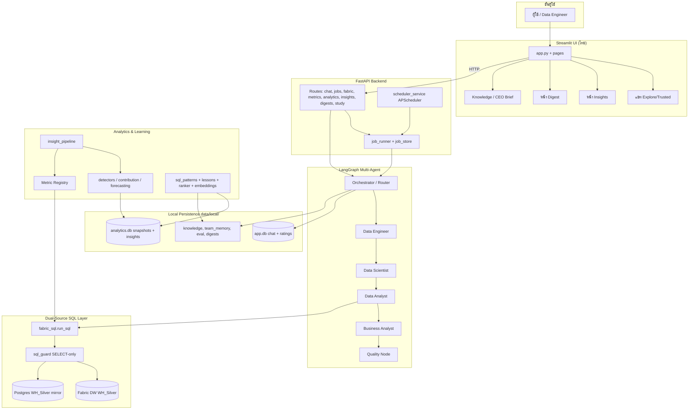
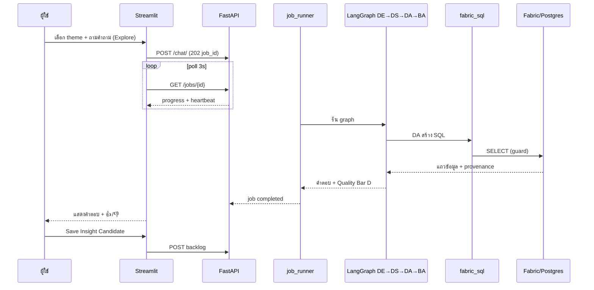
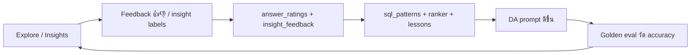

# ภาพรวมโปรเจกต์ — AI Fabric Insight Explorer

**อัปเดต:** 2026-07-18  
**Commit อ้างอิง:** `7b0ba4a` (master)  
**ผู้ใช้หลัก Phase 1:** Data Engineer (solo) — BA/DA เข้ามาภายหลัง  
**ภาษา UI/รายงาน:** ไทย · **SQL/metadata ทางเทคนิค:** อังกฤษ

> เอกสารนี้อธิบายโปรเจกต์ให้ทั้งผู้ที่ไม่ใช่สายเทคนิคและนักพัฒนาเข้าใจร่วมกัน — แยกชัดระหว่าง **โค้ดเสร็จแล้ว (code-complete)** กับ **ยืนยันบน production/live แล้ว (production-verified)**

---

## การดูแลเอกสารนี้ / เงื่อนไขอัปเดต

**กฎ binding:** `AGENTS.md` → *Documentation & Handover Contract* · Cursor: `.cursor/rules/project-documentation-governance.mdc`

### อัปเดตเมื่อใด

| เหตุการณ์ | ส่วนที่ต้องแก้ในเอกสารนี้ |
|---|---|
| เปลี่ยน architecture, API, workflow | §4–6 |
| pytest scope / จำนวนเทสต์เปลี่ยน | §9 + บรรทัดสรุปด้านบน |
| สถานะ live / gate / owner sign-off เปลี่ยน | §3, §11, §15 |
| ปิดหรืออัปเดต phase | header (วันที่ + commit อ้างอิง), §10, §11 + `phase-summaries/phase-{x}.md` |
| งานคงเหลือจัดลำดับใหม่ | §11 |
| Loop Engineering readiness / SCN / QA defects | §9 + §11; รายงาน sanitized ใน `knowledge/07-testing/loop-engineering/` |

### วิธีอัปเดต (ทุกครั้งที่แก้ระบบ)

1. แก้โค้ด/เกตก่อน — แล้วอัปเดตเอกสารใน **ชุดเดียวกัน** (ไม่ปล่อย overview ค้าง)
2. อัปเดตบรรทัด **อัปเดต** และ **Commit อ้างอิง** ด้านบน **หลัง push** ไป remote
3. เขียน/แก้ `phase-summaries/phase-{x}.md` ตาม template ใน `phase-summaries/README.md`
4. ซิงค์ `README.md` เฉพาะ install/run/env — ไม่ copy overview ทั้งฉบับ
5. ก่อน handover: ทบทวน §15 ให้ตรง gate, summary, และความจริงบน live

### ความซื่อสัตย์ (code vs live)

- **Code-complete** = merge + pytest เขียว — ใช้คำว่า "โค้ดเสร็จ" / "tests passed"
- **Production-verified** = มีหลักฐาน live + owner/metric — ใช้เมื่อ gate หรือ §10 ผ่านจริงเท่านั้น
- ห้ามอัปเกรดจากเทสต์อย่างเดียวเป็น production-verified

---

## สารบัญ

1. [Executive summary](#1-executive-summary)
2. [Problem / users / boundaries](#2-problem--users--boundaries)
3. [Current readiness (code vs live)](#3-current-readiness-code-vs-live)
4. [Architecture](#4-architecture)
5. [Component explanations](#5-component-explanations)
6. [E2E workflows](#6-e2e-workflows)
7. [Security / safety](#7-security--safety)
8. [How to run / use on Windows](#8-how-to-run--use-on-windows)
9. [Testing / quality](#9-testing--quality)
10. [Phase journey D / F / G–K](#10-phase-journey-d--f--gk)
11. [Remaining work (prioritized)](#11-remaining-work-prioritized)
12. [Developer onboarding](#12-developer-onboarding)
13. [Troubleshooting](#13-troubleshooting)
14. [Glossary](#14-glossary)
15. [Handover checklist](#15-handover-checklist)

---

## 1. Executive summary

**AI Fabric Insight Explorer** (repo: `ai-analytic-multiagent`) คือ **ทีมวิเคราะห์ข้อมูล AI แบบหลายตัวแทน (multi-agent)** ที่รันบนเครื่อง Windows ของคุณเอง ใช้ถามคำถามธุรกิจเป็นภาษาไทย แล้วให้ระบบช่วยเขียน SQL อ่านจาก **Microsoft Fabric Data Warehouse** (ตาราง SAP ผ่าน WH_Silver) สรุป insight และเก็บเป็น knowledge ที่ผ่านการอนุมัติของมนุษย์

**สิ่งที่ระบบทำได้หลัก ๆ:**

| ความสามารถ | คำอธิบายสั้น |
|---|---|
| **Explore** | ถามคำถาม → ทีม AI (DE/DS/DA/BA) ทำงานร่วมกัน → ได้คำตอบแบบร่าง พร้อม SQL และสมมติฐาน |
| **Trusted** | ใช้นิยาม KPI ที่มนุษย์อนุมัติแล้วเท่านั้น — ลดความเสี่ยงคำตอบผิด |
| **Knowledge loop** | เก็บ glossary, เป้า KPI, ความสัมพันธ์ตาราง → อนุมัติ (HITL) → ใช้ซ้ำในรอบถัดไป |
| **Proactive insights (Phase I+)** | ระบบวิเคราะห์เองตอนกลางคืน แล้วแสดง "เมื่อคืนพบอะไร" ในหน้า Insights |
| **Self-learning (Phase G–K)** | มาตรฐาน KPI (Metric Registry), สถิติจริง, eval harness, feedback, digest รายสัปดาห์ |

**สถานะสรุป (ณ 2026-07-18):**

- **Phase 1–2 + D/F + roadmap G→K:** โค้ดครบบน master (`9a65a20` สำหรับ Phase K)
- **Automated tests:** 390 passed (pytest ชุดเต็มหลัง Phase K)
- **Production-verified:** ยังไม่ครบ — หลายเกตต้องการ Fabric/Postgres เปิด, traffic จริง, และ owner sign-off

**Canvas ภาพรวม:** เปิดไฟล์ interactive ได้ที่  
`C:\Users\weerawat.m\.cursor\projects\c-Projects-ai-analytic-multiagent\canvases\project-overview.canvas.tsx`

---

## 2. Problem / users / boundaries

### ปัญหาที่แก้

- ข้อมูล SAP อยู่ใน Fabric DW ขนาดใหญ่ — คนทั่วไปถามคำถามธุรกิจไม่ได้โดยตรง ต้องพึ่ง DE/DA ทุกครั้ง
- Insight ที่ได้จาก LLM อย่างเดียว **เชื่อถือยาก** — ต้องมี validation, SQL guard, และ human-in-the-loop (HITL)
- องค์ความรู้ (นิยาม KPI, join, glossary) กระจัดกระจาย — ต้องมี loop Explore → validate → Trusted

### ผู้ใช้

| ผู้ใช้ | บทบาท |
|---|---|
| **Data Engineer (ปัจจุบัน)** | ตั้งค่า, scan theme, onboarding ทีม, Explore, promote Trusted |
| **BA / DA (อนาคต)** | รับ handoff report, validate insight, ให้ feedback |
| **ผู้บริหาร (อนาคต)** | อ่าน CEO Briefing / Board Digest |

### ขอบเขต (boundaries)

| ใน scope | นอก scope (Phase 1) |
|---|---|
| อ่าน Fabric/Postgres **SELECT เท่านั้น** | เขียน DDL/DML กลับ Fabric โดยอัตโนมัติ |
| รันบน Windows native (FastAPI + Streamlit + Ollama) | Docker Compose เป็น legacy reference |
| ธีมแรกเน้นยอดขาย/GP จาก CE1SATG | Spoke อื่น ๆ ของ Corporate AI (ยังไม่ integrate) |
| Local storage (`data/local/`) | Cloud multi-tenant SaaS |

### ตำแหน่งใน Corporate AI Hub

ระบบนี้คือ **Corporate LLM Hub** สำหรับ SAP Natural Language Query (Text-to-SQL) — ศูนย์กลางที่ Spoke อื่น (Finance, Production ฯลฯ) สามารถ reuse metric registry, detectors, eval governance ได้ (ดู README § Corporate AI)

---

## 3. Current readiness (code vs live)

### สรุปแยกชั้น

| ชั้น | ความหมาย | สถานะ |
|---|---|---|
| **Code-complete** | มีโค้ด + unit/integration tests ผ่าน | Phase D, F, G, H, I, J, K บน master |
| **Gate artifact ใน git** | หลักฐาน audit ใน `knowledge/05-architecture/phases/gates/` | มี G3, G-done, H/I/J/K-done — บางข้อใน checklist ยัง ⏳ pending live |
| **Production-verified** | รันกับ warehouse จริง + owner ยืนยันผล | **ยังไม่ครบ** — ดู §11 |

### สิ่งที่พร้อมใช้งานได้ทันที (เมื่อตั้ง `.env` + Ollama)

- Streamlit UI + chat แบบ background job + heartbeat progress
- Schema scan / theme discovery (หรือ cache เมื่อ Fabric pause)
- Team onboarding (DE→DS→DA→BA) + Team Memory
- Explore / Trusted pipeline + backlog + promotion HITL
- Metric Registry API + eval harness (offline/harness mode)
- Analytics engine + insight pipeline **โค้ดพร้อม** (แต่ snapshot ยังว่างถ้ายังไม่ refresh)

### สิ่งที่ยังไม่ production-verified

| รายการ | เหตุผล |
|---|---|
| Live golden eval accuracy | Baseline harness = 0% (ยังไม่รัน pipeline จริงครบ) |
| Snapshot backfill 36 เดือน | `analytics.db` อาจ row_count=0 จนกว่าจะ POST refresh |
| Insight pipeline รายสัปดาห์ | `INSIGHT_PIPELINE_ENABLED=false` เป็นค่าเริ่ม — ต้อง owner เปิด |
| Detectors จับ event จริง ≥3 กรณี | synthetic tests ผ่าน — live owner validation ค้าง |
| Digest 4 สัปดาห์ต่อเนื่อง | ต้องเปิด `DIGEST_ENABLED` + รอเวลา |
| Net Profit metric (O-1) | ยัง draft — รอ BA ให้สูตร |

---

## 4. Architecture

**แผนภาพระบบ (mandatory handover standard):** [`docs/diagrams/SYSTEM_DIAGRAMS.md`](docs/diagrams/SYSTEM_DIAGRAMS.md) — architecture, agent collaboration, Explore/onboarding sequences, data-source fallback, learning/insight loops, phase timeline และ readiness map; อัปเดตคู่กับโค้ดตาม `AGENTS.md` → Documentation & Handover Contract — ไม่ใช่เอกสารเสริม

### ภาพรวมชั้นบริการ



**ลำดับ agent มาตรฐาน (Explore / onboarding):** `DE → DS → DA → BA` (Quality assembly หลัง BA)

**แหล่งข้อมูล (dual-source + provenance):**

```
Fabric WH_Silver (primary) → Postgres mirror (auto-fallback) → offline cache
         🟦 fabric              🟨 postgres                    ⚪ offline
```

ทุกผลลัพธ์ SQL ต้องแสดง provenance — **ไม่มี fallback เงียบ**

---

## 5. Component explanations

### 5.1 Streamlit UI (`frontend/`)

| ส่วน | หน้าที่ |
|---|---|
| `app.py` | หน้าหลัก: sidebar theme, mode Explore/Trusted, แชท, progress heartbeat, Knowledge, backlog |
| `pages/insights.py` | Feed insight แบบ proactive (Phase I) — cards, feedback 3 ปุ่ม |
| `pages/digest.py` | Board digest รายสัปดาห์ + eval trend + curriculum pass-rate (Phase K) |
| `components/` | แผง backlog, promotion, validation, theme |

**Heartbeat UX (Phase G):** แยก 3 สถานะ — ทีมยังทำงาน / ติดต่อ backend ไม่ได้ / job ล้มเหลว

### 5.2 Jobs, heartbeat, partial answers

- **Background jobs:** คำถามยาวไม่ block UI — `POST /chat/` → `202 + job_id` → poll `/jobs/{id}`
- **job_runner:** รัน LangGraph + onboarding + `snapshot_refresh` + `insight_pipeline` + `study`
- **heartbeat_at:** ticker ~10s บอกว่า process ยังมีชีวิต (แม้รอ Ollama นาน)
- **Partial answers:** แสดงผล agent ที่เสร็จแล้วก่อน job จบ (deep onboarding commit `4a44365`)

### 5.3 Agents (`backend/app/agents/`)

| Agent | หน้าที่หลัก |
|---|---|
| **Data Engineer (DE)** | Schema, discovery, semantic gaps, relationships |
| **Data Scientist (DS)** | วิจารณ์สมมติฐาน, sanity check, `{analytics_context}` จาก detectors จริง |
| **Data Analyst (DA)** | สร้าง T-SQL, retry loop, metric registry context, SQL patterns |
| **Business Analyst (BA)** | KPI narrative, CEO story, alignment กับ targets |
| **Quality node** | ประกอบ Quality Bar D สำหรับ insight candidate |

**Consultant (Claude):** ภายนอก graph — redaction + audit (Phase 3), ไม่แทนที่ local team

### 5.4 Dual-source provenance (`fabric_sql.py`, Phase F)

- ลำดับ: Fabric → Postgres → offline
- `sql_guard`: SELECT-only + allowlist
- Row-count guard + PDCA failure log (Phase D)
- CAST guidance สำหรับ CE1SATG (varchar measures)

### 5.5 Knowledge, metrics, Trusted HITL

| Store | ที่เก็บ | วงจร |
|---|---|---|
| **knowledge_store** | glossary, targets, relationships | draft → approved (HITL) |
| **metric_registry** | KPI executable definitions | draft → approved → deprecated |
| **semantic_store / backlog** | Trusted definitions, insight candidates | promote หลัง BA validate |
| **team_memory** | onboarding baseline ต่อ theme | CEO approve study results (Phase K) |

**Metric Registry:** SQL ใน scheduled path มาจาก `render_metric_sql` เท่านั้น — **ไม่พึ่ง LLM**

### 5.6 Deep onboarding

- Graph: DE → DS → DA → BA (+ coach)
- ผล: `data/local/team_memory/{theme_id}.json`
- CEO Briefing + feedback routing (DE→relationships, DA→glossary, BA→targets)
- API: `POST /api/v1/onboarding/{theme}/run`

### 5.7 Analytics engine (Phase H)

Pure functions ใน `backend/app/analytics/`:

- **detectors.py** — anomaly, changepoint, trend
- **contribution.py** — GA-style drivers, Pareto, churn
- **forecasting.py** — seasonal naive, optional ETS

**snapshot_store:** `analytics.db` — แยกจาก `app.db` (INV-7)

### 5.8 Proactive insights (Phase I)

Pipeline 5 ขั้น: `refresh_snapshots → run_detectors → score_candidates → narrate_top → publish`

- `validate_narrative_numbers` — เลขใน narrative ต้องมาจาก evidence
- Scheduler: catch-up-on-startup + nightly cron (defer เมื่อ chat active)
- Default: `insight_pipeline_enabled=false`

### 5.9 Learning loops (Phase J)

| วงจร | ไฟล์ | กลไก |
|---|---|---|
| SQL สำเร็จ | `sql_pattern_store` | few-shot ใน DA prompt |
| SQL ผิด | `lesson_miner` + PDCA log | `sql_lessons.json` |
| Insight quality | `insight_ranker` | heuristic → ML เมื่อ labels ≥100 |
| Semantic retrieval | `embedding_service` | Ollama nomic-embed-text |

### 5.10 Digest / study (Phase K)

- **digest_service:** รวม insights useful + QoQ/YoY → `briefings/digests/{yyyy-ww}.json`
- **study job:** curriculum ต่อ role → รันผ่าน graph → รอ CEO approve
- **eval trend:** chart ความแม่นยำ golden questions ข้ามเวลา

### 5.11 Persistence map

```
data/local/
├── app.db                 # chat sessions, answer_ratings
├── analytics/analytics.db # metric_snapshots, insights, sql_patterns, embeddings
├── backlog/               # insight candidates (JSON)
├── semantic/              # trusted + draft definitions
├── knowledge/
│   ├── metric_registry.json
│   ├── sql_lessons.json
│   └── curriculum/{role}.json
├── team_memory/           # onboarding per theme
├── eval/                  # golden_questions + results/
├── briefings/digests/     # weekly board digests
├── themes/                # cached theme list
└── logs/backend.log
```

---

## 6. E2E workflows

### 6.1 Explore คำถามธุรกิจ (flow หลัก)



### 6.2 Trusted promotion

1. Insight candidate ใน backlog → export Markdown handoff (ไทย)
2. BA/DA feedback → status `validated`
3. HITL approve → `POST semantic/promote`
4. Trusted mode ใช้ SQL template ที่อนุมัติแล้วเท่านั้น

### 6.3 Proactive insight (overnight)

1. Scheduler/catch-up enqueue `insight_pipeline`
2. Refresh snapshots จาก Metric Registry
3. Detectors หา anomaly/changepoint
4. Score + narrate top-K (Ollama) + validate ตัวเลข
5. Publish → หน้า Insights → user feedback → ranker labels

### 6.4 Learning loop (ต่อเนื่อง)



---

## 7. Security / safety

| มาตรการ | รายละเอียด |
|---|---|
| **Fabric read-only** | Service Principal + sql_guard ปฏิเสธ non-SELECT |
| **ไม่ auto-write DW** | ข้อเสนอ DDL/DML ต้อง human gate |
| **Secrets ใน `.env`** | ไม่ commit — ใช้ `.env.example` เป็น template |
| **Consultant redaction** | ก่อนส่ง Claude ตัดข้อมูลอ่อนไหว |
| **Error sanitizer** | ไม่ leak stack/SQL ละเอียดไป UI (Phase D) |
| **Provenance บังคับ** | ผู้ใช้รู้ว่าข้อมูลมาจาก Fabric / Postgres / offline |
| **HITL** | Trusted promotion, knowledge approve, CEO study approve |

---

## 8. How to run / use on Windows

### ครั้งแรก

1. Clone repo → `copy .env.example .env` → กรอก `FABRIC_*`, `OLLAMA_*`
2. ติด ODBC Driver 18, grant SP ใน Fabric workspace
3. `.\scripts\setup-ollama-models.ps1`
4. Terminal 1: `.\scripts\run-backend.ps1`
5. Terminal 2: `.\scripts\run-frontend.ps1`
6. เปิด http://127.0.0.1:8501 — ตรวจ Fabric health ใน sidebar

### ทุกครั้งที่ใช้งาน

| ขั้น | การกระทำ |
|---|---|
| 1 | Scan schema → เลือก theme |
| 2 | รอ discovery + onboarding (ครั้งแรก ~20–40 นาที) |
| 3 | อ่าน CEO Briefing → ให้ feedback |
| 4 | เติม Knowledge (glossary/targets) ตามต้องการ |
| 5 | Explore: ถามคำถาม → ดู progress heartbeat |
| 6 | Save candidate → export → validate → promote Trusted |
| 7 | (Optional) เปิด Insights/Digest หลัง enable flags ใน `.env` |

### Fabric pause / offline

- ใช้ cache ได้ถ้ามี `themes/cached_themes.json` + `discovery.json`
- ยังต้องมี Ollama — ไม่ execute SQL จริง

### Feature flags สำคัญ (`.env`)

| Key | Default | ความหมาย |
|---|---|---|
| `INSIGHT_PIPELINE_ENABLED` | false | เปิด proactive pipeline |
| `DIGEST_ENABLED` | false | digest รายสัปดาห์ |
| `STUDY_ENABLED` | false | nightly curriculum study |
| `FABRIC_SQL_ENABLED` | true | ปิดเพื่อบังคับ offline |

---

## 9. Testing / quality

### รันทดสอบ

```powershell
$env:PYTHONPATH = "."
python -m pytest backend/tests/ -q

# Loop Engineering readiness (L0 env + L1 offline by default)
.\scripts\run-readiness-check.ps1
.\scripts\run-readiness-check.ps1 -Level 0
```

### ชั้นคุณภาพ

| ชั้น | เครื่องมือ |
|---|---|
| Unit / integration | pytest (~390 tests) |
| Roadmap invariants | `test_roadmap_conformance.py` (INV-1..INV-12) |
| Phase DoD scripts | `validate-phase1.ps1`, `validate-phase2.ps1` |
| Golden eval | `scripts/run-golden-eval.ps1` |
| **Loop Engineering QA** | Skill `.cursor/skills/engineering-qa/loop-engineering-qa/` + `scripts/run-readiness-check.ps1` + catalog `knowledge/07-testing/loop-engineering/` |
| Owner sign-off docs | `knowledge/07-testing/sign-off.md` |

Loop Engineering **แนะนำความพร้อมเท่านั้น** — ไม่แทน Trusted / KPI / production sign-off และไม่ commit/push เองจนกว่าเจ้าของระบบจะสั่ง

**Full-system readiness (2026-07-18, DEF-001 fix run `20260718-203027-487673`):** L0 SCN-ENV-002 **pass** หลังตั้ง `OLLAMA_MODEL=qwen2.5-coder:3b` (7b OOM เดิม); L1 **390** pytest + **11** conformance ผ่าน; L2 SCN-CHAT-001 **partial/not-run** (wall-time cap บน CPU); **DEF-001 Fixed**; **production-verified: no**. รายงาน: `knowledge/07-testing/loop-engineering/run-reports/2026-07-18-model-downsize-20260718-203027-487673.md` · readiness: `…/readiness/2026-07-18-full-system-readiness.md` · prior fail: `…/2026-07-18-full-system-20260718-191418-3b7689.md`

### Quality Bar D (Explore)

คำตอบต้องมีครบ: สรุป, SQL, สมมติฐาน, confidence, คำถามถาม BA/DA — **ไม่เท่ากับ "ถูกต้องเชิงตัวเลข"** (ใช้ golden eval วัด)

---

## 10. Phase journey D / F / G–K

### Timeline (commits บน master)

| Phase | เนื้อหาหลัก | Commit | Code | Live verified |
|---|---|---|---|---|
| **D** | Pipeline hardening — row guard, retry, PDCA, sanitizer | `68c8c28`…`f40784e` | ✅ | ⏳ manual Fabric tests |
| **F** | Postgres mirror fallback + provenance | `8e34d28` | ✅ | ⏳ DBA parity checklist |
| **G** | Heartbeat, ratings, metric registry, eval harness | `df3a5f4` | ✅ | ⏳ live eval, UI smoke |
| **H** | Analytics engine + snapshot refresh | `fde9a2f` | ✅ | ⏳ timed backfill, owner events |
| **I** | Insight pipeline + scheduler + Insights UI | `2525108` | ✅ | ⏳ 1 สัปดาห์ unattended |
| **J** | Learning loops — embeddings, patterns, ranker | `08f3af2` | ✅ | ⏳ accuracy +10%, AUC live |
| **K** | Digest, study, aggregate knowledge, eval trend | `9a65a20` | ✅ | ⏳ digest 4 สัปดาห์ |
| **Docs sync** | Gate/summary commit hashes | `7b0ba4a` | ✅ | — |

**หมายเหตุ:** Deep onboarding (`4a44365`) ไม่ใช่ phase ตัวอักษร — เป็นงานระหว่างทางก่อน G

### Gate artifacts

| ไฟล์ | สถานะ |
|---|---|
| `G3-baseline-recorded.md` | ✅ harness baseline (accuracy 0%) |
| `G-done.md` | ✅ โค้ดครบ — manual gates ค้าง |
| `H-done.md` | ✅ — live backfill ค้าง |
| `I-done.md` | ✅ — live scheduling ค้าง |
| `J-done.md` | ✅ — live §9 metrics ค้าง |
| `K-done.md` | ✅ — live §10 metrics ค้าง |

### pytest trend

| หลัง phase | Passed |
|---|---|
| Phase G | 274 (+ 7 skipped) |
| Phase H | ~302 |
| Phase J | 379 |
| Phase K | **390** |

---

## 11. Remaining work (prioritized)

### P0 — บล็อกความเชื่อมั่นข้อมูล

1. **O-1 Net Profit** — BA ให้สูตร → promote `metric.net_profit`
2. **Live snapshot backfill** — `POST /api/v1/analytics/refresh` บน mirror จริง (<10 นาที)
3. **G3 baseline v2** — รัน golden eval ผ่าน Ollama+SQL → `G3-baseline-recorded-v2.md`

### P1 — เปิดใช้ proactive + วัดผล

4. เปิด `INSIGHT_PIPELINE_ENABLED=true` ≥1 สัปดาห์ — เก็บ insights/week, useful%
5. Owner validate detectors ≥3 เดือนที่รู้จริง
6. UI smoke: heartbeat + ratings + insights feedback

### P2 — Learning & world-class live

7. สะสม labels (ratings + insight feedback) → เปิด embedding/sql-pattern flags
8. รัน `mine_lessons.py` เป็นระยะ (owner ตัดสิน job kind)
9. เปิด `DIGEST_ENABLED` + `STUDY_ENABLED` — digest 4 สัปดาห์, curriculum pass-rate โต
10. Owner ยืนยัน eval trend "ฉลาดขึ้นจริง"

### P3 — องค์กร / ข้อมูล

11. Phase F DBA checklist + `verify_pg_parity.py` live
12. O-2 discount rate — BA ยืนยันแทน provisional
13. Optional Phase E sandbox (`execute_python`) — deferred

### Loop Engineering (framework พร้อม — ใช้ก่อนทดสอบจริง)

14. รัน `.\scripts\run-readiness-check.ps1` (L0+L1) ก่อน manual Explore; ดู catalog ที่ `knowledge/07-testing/loop-engineering/`
15. **ปิดแล้ว (2026-07-18):** `DEF-001` — Fixed ผ่านโมเดลเล็กลง `qwen2.5-coder:3b` (SCN-ENV-002 เขียว); manual Explore **with caveats** (คุณภาพต่ำกว่าเป้า ~14B; L2 chat ยังไม่จบภายใน wall-time); Fabric capacity ไม่ active (human/ops)
16. **ถัดไป (ไม่บล็อก framework):** L2 chat เต็มเมื่อมีเวลา/GPU; ต่อ live `answer_fn` ใน golden eval; Playwright UI E2E; pytest markers offline/live; optional กลับ 7b/14b เมื่อมี RAM

---

## 12. Developer onboarding

### อ่านก่อนแตะโค้ด

1. `AGENTS.md` — สัญญ agent + Phase 1 locked decisions
2. `knowledge/05-architecture/phases/phase-g-to-k-grand-roadmap.md` §4 — **บังคับ** ถ้า implement G–K
3. Phase doc ที่เกี่ยวข้อง + gate README
4. ก่อนทดสอบจริง: `knowledge/07-testing/loop-engineering/` + `.\scripts\run-readiness-check.ps1` (หรือสั่ง Cursor skill loop-engineering-qa)

### โครงสร้างสำคัญ

```
backend/app/
├── agents/          # LangGraph orchestrator, DE/DS/DA/BA
├── analytics/       # pure stats (Phase H) — ห้าม I/O
├── api/routes/      # REST endpoints
├── services/        # stores, fabric, jobs, pipelines
└── core/            # config, llm factory

frontend/
├── app.py
├── pages/           # insights.py, digest.py
└── components/
```

### กฎ implement Phase G–K

- สร้าง phase doc จาก `_TEMPLATE-phase.md` **ก่อน** code
- อย่าอ่อน `test_roadmap_conformance.py`
- Deviation จาก locked decisions → owner approve ใน Deviation Log
- จบ phase → gate artifact ใน `gates/`

### Branch / commit

- Master ณ `7b0ba4a` — docs sync gates
- Feature work: ทำใน branch แล้ว PR ตามปกติ

---

## 13. Troubleshooting

| อาการ | แนวทาง |
|---|---|
| ถามแล้วรอนาน | เป็น background job — ดู heartbeat; refresh browser ได้ (re-attach thread) |
| UI ว่างหลัง timeout | ดู `data/local/logs/backend.log` หรือ job timeline |
| Backend restart กลาง job | job ถูก mark failed — partial ใน chat history ยังอยู่ |
| Fabric not configured | กรอก `.env` FABRIC_* แล้ว restart |
| Invalid client secret | ใช้ secret **Value** ไม่ใช่ Secret ID |
| ODBC 18 not found | `winget install Microsoft.msodbcsql.18` |
| Ollama OOM | ลด model เป็น `qwen2.5-coder:7b` |
| UI เรียก API ไม่ได้ | `BACKEND_URL=http://127.0.0.1:8000` |
| analytics.db ว่าง | รัน snapshot refresh เมื่อ SQL source พร้อม |
| Insight pipeline ไม่รัน | ตั้ง `INSIGHT_PIPELINE_ENABLED=true` + ตรวจ scheduler logs |

---

## 14. Glossary

| คำศัพท์ | ความหมาย |
|---|---|
| **Explore** | โหมดร่าง — ใช้ LLM + SQL อิสระภายใต้ guard |
| **Trusted** | โหมดอนุมัติ — ใช้นิยาม KPI/SQL ที่ HITL แล้ว |
| **HITL** | Human-in-the-loop — มนุษย์อนุมัติก่อ promote |
| **Theme** | ชุดตาราง/หัวข้อวิเคราะห์ (เช่น ยอดขายและลูกค้า) |
| **LangGraph** | framework จัดลำดับ agent เป็น graph |
| **Metric Registry** | ทะเบียน KPI ที่ render SQL ได้แบบ deterministic |
| **Provenance** | ป้ายแหล่งข้อมูล fabric/postgres/offline |
| **Golden questions** | ชุดคำถามมาตรฐานวัด accuracy |
| **Detector** | ฟังก์ชันสถิติจับ anomaly/changepoint (ไม่ใช่ prompt) |
| **Insight pipeline** | งานอัตโนมัติสร้าง insight จาก detectors |
| **PDCA log** | บันทึกความล้มเหลว SQL สำหรับ lesson mining |
| **CEO Briefing** | สรุป 4 role หลัง onboarding |
| **Board digest** | รายงานสัปดาห์รวม insights + KPI trend |

---

## 15. Handover checklist

ใช้ checklist นี้เมื่อส่งมอบโปรเจกต์ให้ owner / ทีมใหม่

### เอกสาร

- [ ] อ่าน `PROJECT_OVERVIEW.md` (เอกสารนี้)
- [ ] เปิด [project-overview.canvas.tsx](file:///C:/Users/weerawat.m/.cursor/projects/c-Projects-ai-analytic-multiagent/canvases/project-overview.canvas.tsx) ใน Cursor
- [ ] อ่าน `AGENTS.md` + roadmap §4 guardrails
- [ ] ทบทวน phase-summaries G–K + gates/

### สภาพแวดล้อม

- [ ] `.env` ครบ (ไม่ commit secrets)
- [ ] Fabric SP + workspace access
- [ ] Ollama รัน + model pull แล้ว
- [ ] `pytest backend/tests -q` ผ่าน 390 tests

### การยืนยัน live (production gates)

- [ ] Snapshot backfill สำเร็จ + provenance ถูกต้อง
- [ ] Golden eval v2 บันทึกแล้ว
- [ ] Insight pipeline รัน ≥1 สัปดาห์ + metrics ตาม I-done
- [ ] Digest + study เปิด ≥4 สัปดาห์ (ถ้าต้องการ Phase K live)
- [ ] Owner sign-off O-1 Net Profit + O-2 discount จริง
- [ ] อัปเดต `knowledge/07-testing/sign-off.md` เมื่อพร้อม

### สิ่งที่ไม่ควรทำ

- [ ] อย่า write Fabric โดยไม่ approve
- [ ] อย่าอ่อน conformance tests
- [ ] อย่าแก้ gate เก่าย้อนหลัง — สร้าง `-v2` แทน

---

## เอกสารที่เกี่ยวข้อง

| หัวข้อ | Path |
|---|---|
| คู่มือติดตั้ง/รัน | `README.md` |
| PRD | `knowledge/03-prd/prd.md` |
| Architecture (signed off) | `knowledge/05-architecture/architecture/Architecture.md` |
| Roadmap G→K | `knowledge/05-architecture/phases/phase-g-to-k-grand-roadmap.md` |
| Phase summaries | `phase-summaries/` |
| Gates | `knowledge/05-architecture/phases/gates/` |
