# แผนภาพระบบ — AI Fabric Insight Explorer

เอกสารภาพสำหรับอ่านร่วมกันระหว่างผู้ใช้ธุรกิจ เจ้าของระบบ และนักพัฒนา โดยอ้างอิงจากโค้ดและเอกสารสถานะ ณ วันที่ 2026-07-18

> ป้ายแหล่งข้อมูลที่ระบบใช้จริง: **Fabric** = แหล่งหลัก, **Postgres mirror** = แหล่งสำรองเมื่อ Fabric ใช้ไม่ได้, **Offline** = ใช้ cache/discovery บนดิสก์และไม่รัน SQL จริง ทุกคำตอบหรือ insight ต้องแสดง provenance และห้าม fallback แบบเงียบ

## 1. ภาพรวมสถาปัตยกรรม

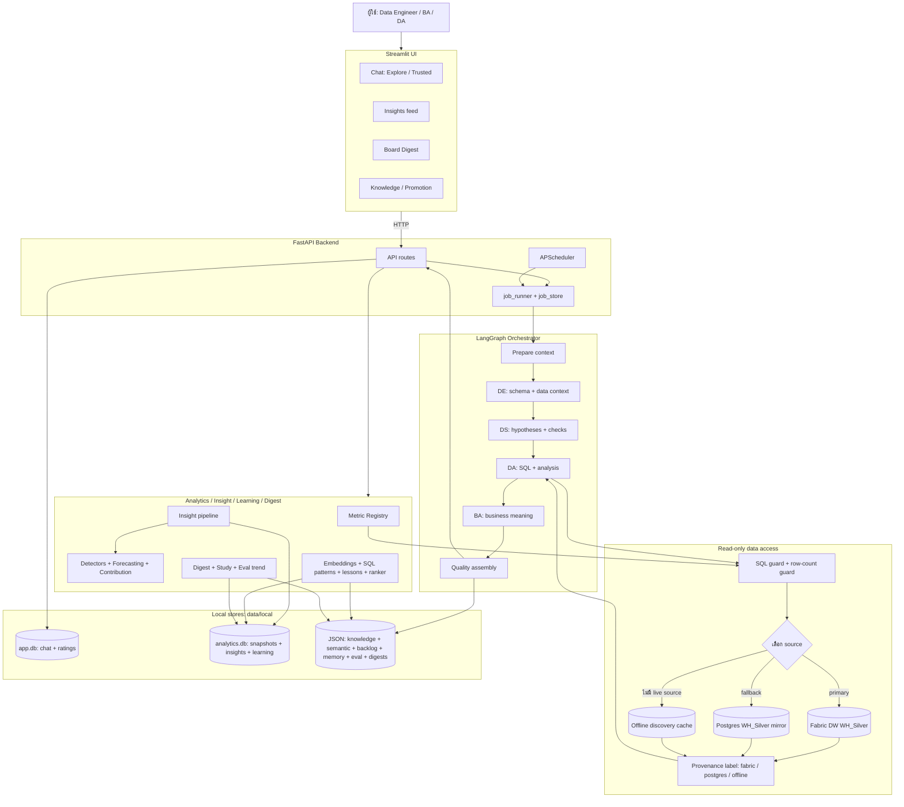

**คำอธิบายแบบสั้น:** ผู้ใช้คุยผ่าน Streamlit แล้ว FastAPI ส่งงานยาวให้ `job_runner` ทีม AI ทำงานตามลำดับและอ่านข้อมูลแบบ read-only เท่านั้น ผลที่ได้ถูกติดป้ายแหล่งข้อมูลก่อนแสดงหรือเก็บลง local stores ส่วนงานวิเคราะห์อัตโนมัติใช้ engine ชุดเดียวกันผ่าน backend

## 2. ลำดับการร่วมงานของ Agent

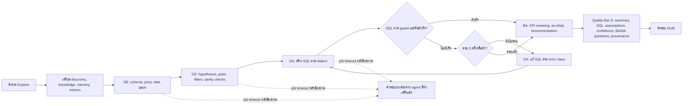

**คำอธิบายแบบสั้น:** DE ช่วยให้ทีมเข้าใจข้อมูล, DS วางวิธีตรวจ, DA เขียนและลองแก้ SQL ได้สูงสุด 3 รอบ, BA แปลผลเป็นภาษาธุรกิจ แล้วระบบประกอบคำตอบตาม Quality Bar D หากงานหมดเวลา ระบบคืนผลงานที่ทำเสร็จแล้วเป็น “คำตอบบางส่วน” แทนหน้าว่าง

## 3. Explore question แบบ end-to-end

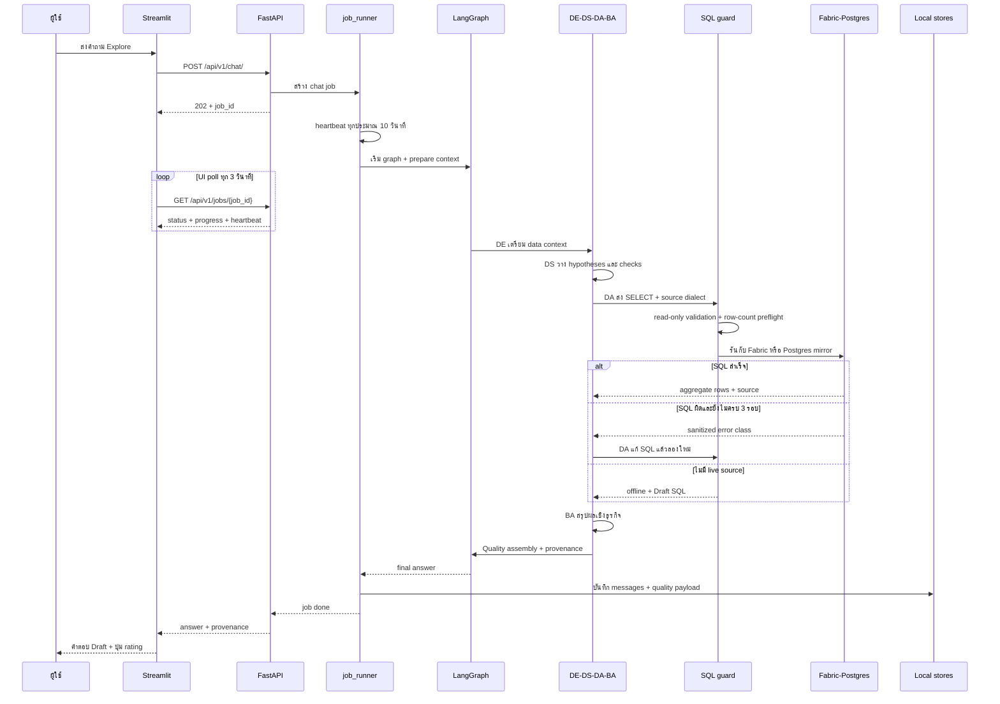

**คำอธิบายแบบสั้น:** หน้าจอไม่ต้องรอ request เดียวยาว ๆ เพราะ backend คืน `job_id` ทันที จากนั้น UI ติดตามชีพจรและขั้นตอนของทีม ระหว่างทาง SQL ถูกจำกัดเป็น read-only และตรวจขนาดผลลัพธ์ ก่อนประกอบคำตอบพร้อมป้ายแหล่งข้อมูล

## 4. Deep onboarding: Homework + Starter Pack

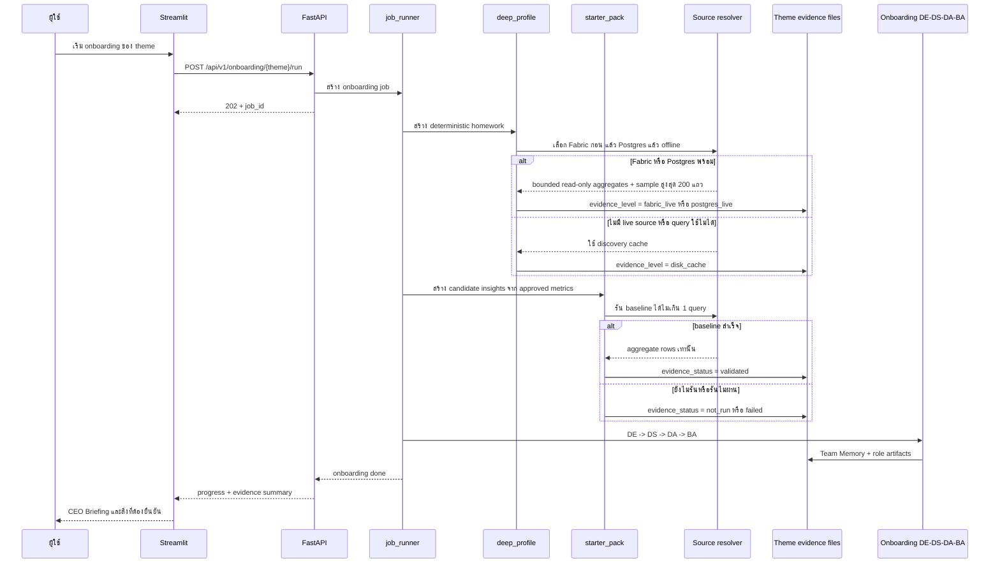

**คำอธิบายแบบสั้น:** ก่อนทีม AI สรุป onboarding ระบบทำ “การบ้านข้อมูล” แบบ deterministic ก่อน โดย query ถูกจำกัดขอบเขตและอ่านอย่างเดียว หลักฐานจะแยกชัดว่าเป็น live จาก Fabric/Postgres หรือเป็นเพียง disk cache และ starter insight ที่ยังไม่รันจะไม่ถูกเรียกว่าเป็นข้อค้นพบ

## 5. การเลือกแหล่งข้อมูล

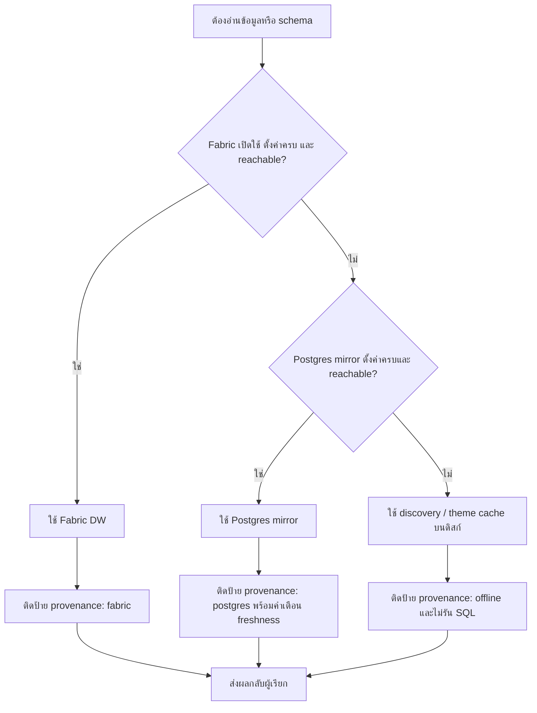

**คำอธิบายแบบสั้น:** ระบบเลือกแหล่งข้อมูลก่อนสร้าง SQL เพื่อให้ใช้ dialect ถูกต้อง โดยให้ Fabric มาก่อนเสมอ หาก fallback ไป Postgres หรือ offline ผู้ใช้ต้องเห็นป้ายชัดเจน ไม่มีการสลับแหล่งข้อมูลแบบเงียบ

## 6. วงจรเรียนรู้จากการใช้งาน

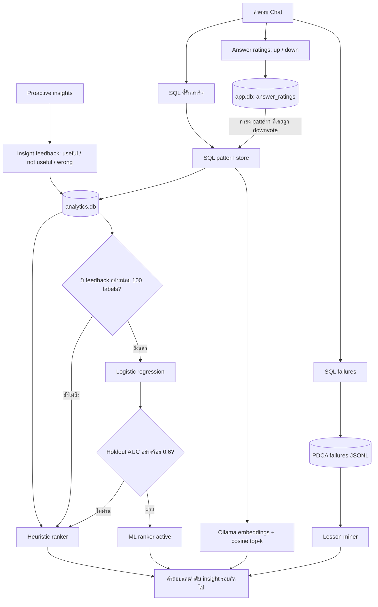

**คำอธิบายแบบสั้น:** ระบบจำทั้งสิ่งที่ทำสำเร็จและสิ่งที่ผิด SQL patterns กับ lessons ช่วย DA รอบถัดไป ส่วน insight ranker ใช้สูตร heuristic เป็นค่าเริ่มต้น และจะใช้โมเดลที่ฝึกจริงก็ต่อเมื่อมีอย่างน้อย 100 labels และผ่าน AUC gate เท่านั้น ปัจจุบัน live labels ยังเป็น cold start

## 7. Proactive insight pipeline

```mermaid
flowchart LR
    triggers["Scheduler catch-up / nightly / ปุ่มรันทันที"]
    runner["job_runner: insight_pipeline"]
    refresh["Refresh snapshots"]
    registry["Approved Metric Registry"]
    source["Fabric / Postgres ผ่าน guard"]
    snapshots[("analytics.db snapshots")]
    detectors["Anomaly + Changepoint + Trend"]
    forecast["Forecast residual"]
    contribution["Contribution module"]
    score["Score: significance x impact x novelty"]
    ranker["Ranker: heuristic หรือ gated ML"]
    narrative["Ollama narrative จาก evidence"]
    validator{"ตัวเลขอยู่ใน evidence ครบ?"}
    retry["Narrate ใหม่ 1 ครั้ง"]
    template["Deterministic fallback template"]
    publish["Publish insight + provenance"]
    feed["Streamlit Insights feed"]
    feedback["Useful / Not useful / Wrong"]

    triggers --> runner --> refresh
    registry --> refresh
    refresh --> source --> snapshots
    snapshots --> detectors --> score
    snapshots --> forecast --> score
    snapshots -. "มีโมดูลแล้ว แต่ current scheduled pipeline ยังไม่เรียก" .-> contribution
    score --> ranker --> narrative --> validator
    validator -->|"ผ่าน"| publish
    validator -->|"ไม่ผ่าน"| retry --> validator
    validator -->|"ยังไม่ผ่าน"| template --> publish
    publish --> feed --> feedback
```

**คำอธิบายแบบสั้น:** Scheduler ส่งงานผ่าน `job_runner` แล้ว refresh snapshot จากสูตร KPI ที่อนุมัติแบบ deterministic จากนั้น detector และ forecast หาเหตุการณ์, rank, เล่าเรื่อง และตรวจว่าตัวเลขทุกตัวมีใน evidence ก่อน publish ส่วน `contribution.py` มีใน analytics engine แล้ว แต่โค้ด scheduled pipeline ปัจจุบันยังไม่ได้เรียกโมดูลนี้โดยตรง

## 8. วงจร Knowledge, Metric และ Trusted

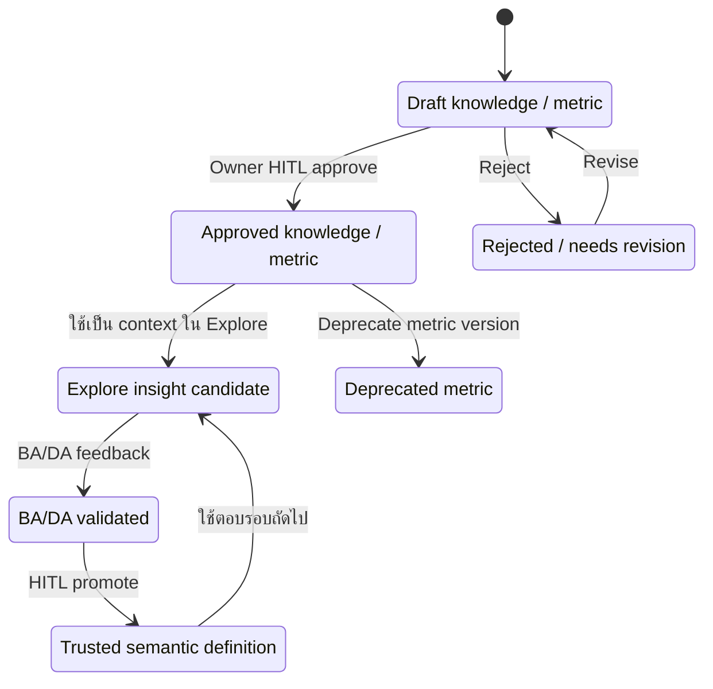

**คำอธิบายแบบสั้น:** ข้อมูลที่เพิ่งเพิ่มยังเป็น Draft และยังไม่ควรถูกใช้เป็นความจริง จนกว่า owner จะ approve ส่วนคำตอบ Explore ต้องผ่าน BA/DA validation และ human promotion อีกชั้นก่อนเข้า Trusted semantic layer

## 9. เส้นทาง Phase D ถึง K

```mermaid
flowchart LR
    phaseD["D: Pipeline hardening; Code complete; Live Fabric checks pending"]
    phaseF["F: Postgres fallback; Code complete; DBA parity pending"]
    deep["Deep onboarding; Homework + partial answers; ไม่มี formal gate"]
    phaseG["G: Heartbeat + Registry + Eval; Code complete; Live eval pending"]
    phaseH["H: Analytics engine; Code complete; Live backfill pending"]
    phaseI["I: Proactive insights; Code complete; Unattended live run pending"]
    phaseJ["J: Learning loops; Code complete; Live labels and metrics pending"]
    phaseK["K: Digest + Study; Code complete; 4-week live evidence pending"]

    phaseD --> phaseF --> phaseG --> phaseH --> phaseI --> phaseJ --> phaseK
    phaseF -. "งานระหว่างทางก่อน G" .-> deep
    deep -.-> phaseG
```

**คำอธิบายแบบสั้น:** ทุก phase ในเส้นหลัก D, F, G, H, I, J, K มีโค้ดและ automated tests แล้ว แต่ยังไม่เท่ากับยืนยันบน production งาน live ที่ค้างต่างกัน เช่น parity, backfill, eval, scheduler, labels และการรัน digest ต่อเนื่อง

## 10. Readiness map: Code-complete เทียบกับ Production-verified

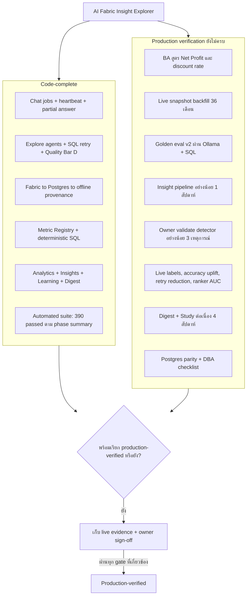

**คำอธิบายแบบสั้น:** ระบบพร้อมในระดับโค้ด แต่หลักฐานจาก environment จริงยังไม่ครบ จุดที่สำคัญที่สุดคือยืนยันสูตร KPI, เติม snapshot จริง, รัน eval จริง และปล่อย pipeline ทำงานต่อเนื่องพร้อม owner sign-off

## 11. Loop Engineering QA (readiness before real testing)

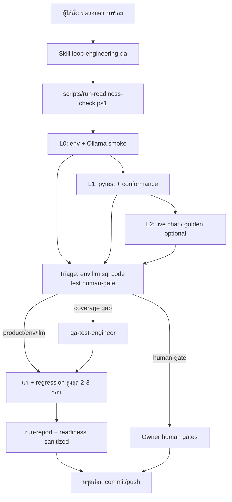

**คำอธิบายแบบสั้น:** Loop Engineering เป็นศูนย์กลางทดสอบความพร้อมก่อนใช้งานจริง รันชั้น L0–L2 แล้ว triage และแนะนำ readiness — **ไม่แทน** Trusted/KPI/production sign-off และไม่ commit/push เองจนกว่าเจ้าของระบบจะสั่ง ดู catalog ที่ `knowledge/07-testing/loop-engineering/scenario-catalog.md`

## ตัวเลือกภาพแบบ Interactive

Canvas ภาพรวมเดิมยังมีอยู่และใช้เป็นตัวเลือกสำหรับเปิดดูแบบ interactive ใน Cursor:

`C:\Users\weerawat.m\.cursor\projects\c-Projects-ai-analytic-multiagent\canvases\project-overview.canvas.tsx`

ไฟล์ Canvas อยู่นอก repository และไม่ได้ถูกแก้ในงานเอกสารชุดนี้

## Maintenance

ไฟล์นี้เป็น **mandatory handover artifact** ตาม `AGENTS.md` → **Documentation & Handover Contract** — อัปเดตใน change set เดียวกับโค้ด/เอกสารที่เกี่ยวข้อง ไม่ใช่ภาพประกอบเสริม

### เมื่อไหร่ต้องอัปเดต

| การเปลี่ยนในระบบ | Section ที่แก้ |
|---|---|
| สถาปัตยกรรมชั้นบริการ, local stores, engine modules | §1 |
| ลำดับ agent, SQL retry, partial answer, Quality Bar | §2 |
| Explore chat flow, job polling, API sequence | §3 |
| Deep onboarding, homework, starter pack | §4 |
| Fabric → Postgres → offline fallback, provenance | §5 |
| Learning loops, ratings, ranker gates | §6 |
| Proactive insight pipeline, detectors, narrative | §7 |
| Knowledge / metric / Trusted lifecycle | §8 |
| Phase timeline D→K, code-complete labels | §9 |
| Readiness map, live gates, verification status | §10 |
| Loop Engineering QA flow / readiness runner | §11 |

### กฎการดูแล

- ใช้ชื่อ service และสถานะจากโค้ด/phase summaries — ไม่ใช้ชื่อเชิงการตลาดแทน behavior จริง
- แยก **Code-complete** กับ **Production-verified** เสมอ (ห้ามสื่อว่า live verified จาก tests อย่างเดียว)
- Mermaid ใช้เฉพาะ `flowchart`, `sequenceDiagram`, `stateDiagram-v2` เพื่อ render ได้ทั้ง Cursor และ GitHub
- ถ้าอัปเดต diagram ไม่ทัน — บันทึก **diagram debt** ใน phase summary และ `PROJECT_OVERVIEW.md` §11
